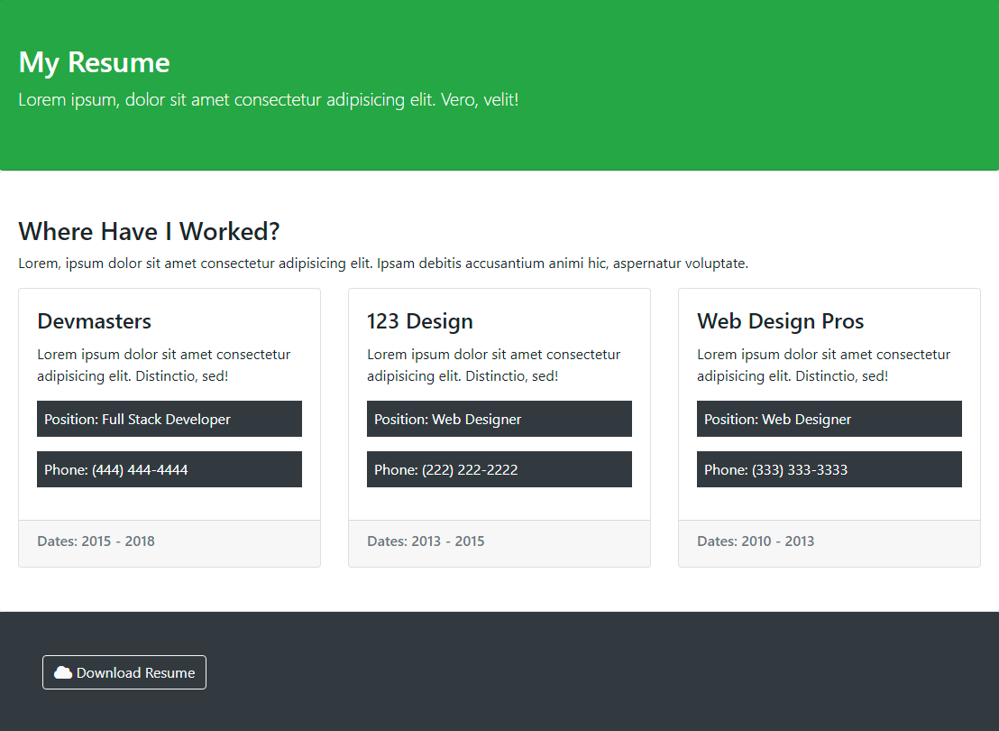
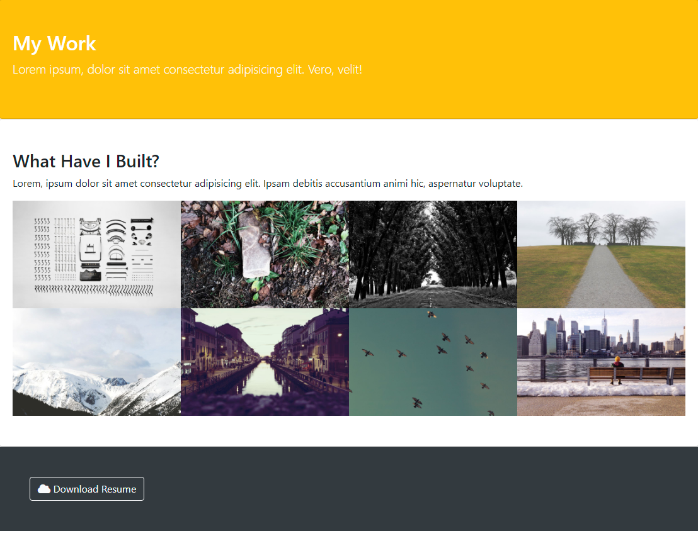
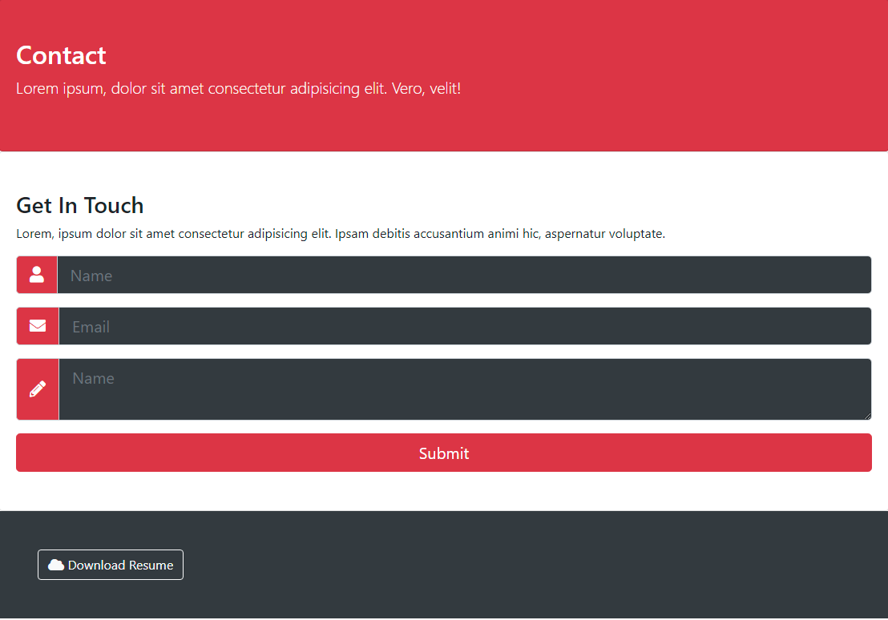

# Udemy PortfolioGrid Project
This project is for learning purpose using Bootstrap 4.
PorfolioGrid is a responsive portfolio website sample.

## Components
- Collapse modul
- Flexbox
- Ekko Lightbox effect for images
- Basic form with some input groups, input prepends

## Screenshot of the page
###Home

###Resume

###Work

###Contact

## External Resources Used
This site was built using:
- [Bootstrap](https://getbootstrap.com/)
- [Font Awesome](https://fontawesome.com/)
- [Ekko-lightbox](https://cdnjs.com/libraries/ekko-lightbox)